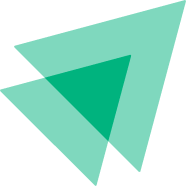
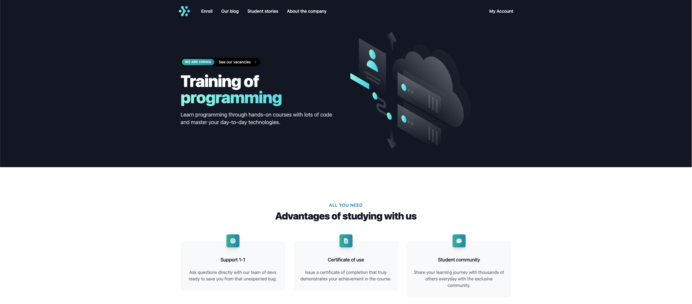

<h1 align="center">
  
</h1>

<h3 align="center">
  Platform for purchasing and enrolling in programming courses
</h3>

<p align="center">
  <a href="#-about-the-project">About the project</a> •
  <a href="#-technologies">Technologies</a> •
  <a href="#-getting-started">Getting started</a> •
  <a href="#-license">License</a>
</p>

<p align="center">
  
</p>

## 👩‍💻 About the project

Project created to better understand some technologies, such as Kafka and NestJS

## 🚀 Technologies

- [Next.js](https://nextjs.org/)
- [ReactJS](https://reactjs.org/)
- [TypeScript](https://www.typescriptlang.org/)
- [NodeJS](https://nodejs.org/en/)
- [NestJS](https://nestjs.com/)
- [GraphQL](https://graphql.org/)
- [Apollo Federation](https://www.apollographql.com/apollo-federation/)
- [Apache Kafka](https://kafka.apache.org/)
- [Yarn](https://yarnpkg.com/)
- [Prisma](https://www.prisma.io/)

## 💻 Getting started

### Requirements

- [Node.js](https://nodejs.org/en/)
- [Yarn](https://classic.yarnpkg.com/) or [NPM](https://www.npmjs.com/) _(examples are with yarn)_

**Clone the project and access the folder**

```bash
$ git clone https://github.com/henriquecampaner/ig-lab && cd ig-lab
```

**Follow the steps below**

```bash
# Clone Repository
$ git clone https://github.com/RodrigoSaantos/ignite-lab.git

# Run Docker Compose
$ docker-compose up -d

# Go to folder classroom
$ cd classroom/

# Install Dependencies
$ yarn
# or
$ npm install

# Run Application
$ yarn start:dev
# or
$ npm run start:dev

# Access localhost
http://localhost:3334/graphql

# Go to folder purchases
$ cd purchases/

# Install Dependencies
$ yarn
# or
$ npm install

# Run Application
$ yarn start:dev
# or
$ npm run start:dev

# Access localhost
http://localhost:3333/graphql

# Go to folder gateway
$ cd gateway/

# Install Dependencies
$ yarn
# or
$ npm install

# Run Application
$ yarn start:dev
# or
$ npm run start:dev

# Access localhost
http://localhost:3332/graphql

# Go to folder web
$ cd web/

# Install Dependencies
$ yarn
# or
$ npm install

# Run Application
$ yarn dev
# or
$ npm run dev

# Access localhost
http://localhost:3000
```

## 📝 License

This project is licensed under the MIT License - see the [LICENSE](LICENSE) file for details.

---

.

<p align="center">
  Made with 💜&nbsp; by <a href="https://www.linkedin.com/in/henrique-campaner/">Henrique Campaner</a>
</p>
